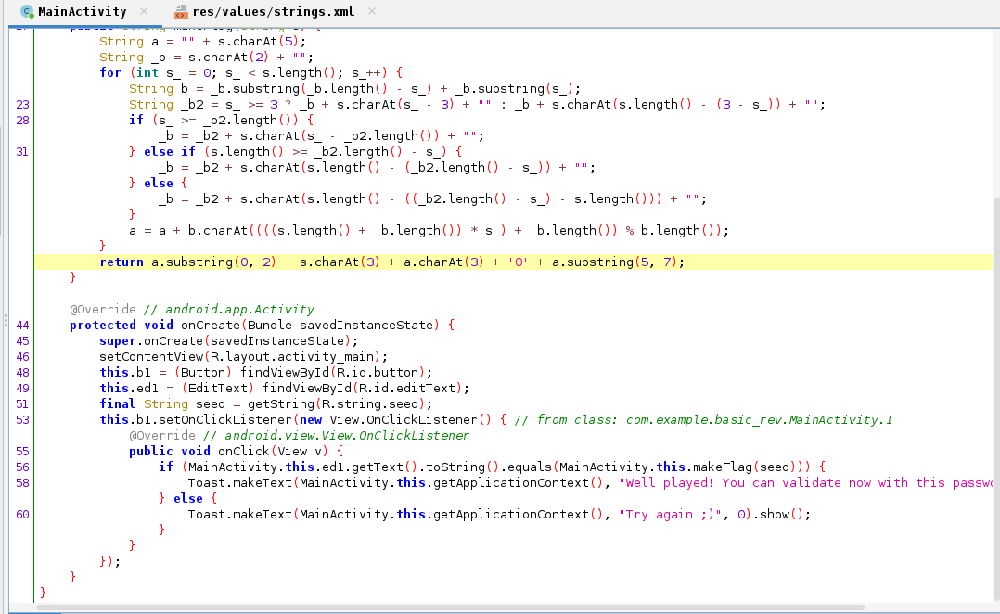
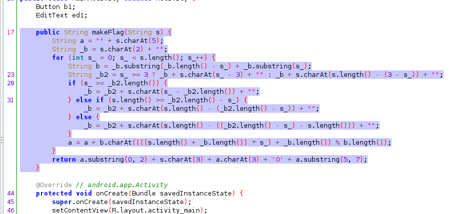
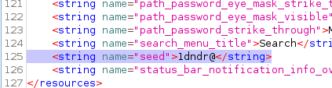
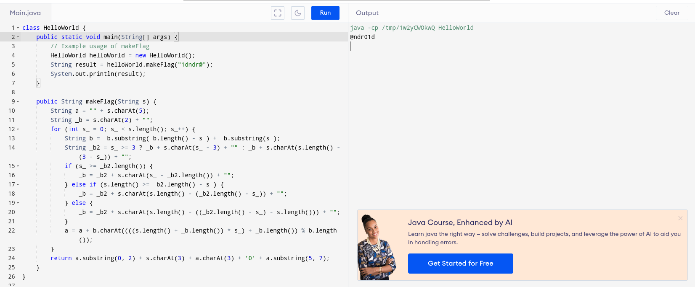

# APK - Introduction CTF Challenge Writeup

## Challenge Information
- **Name**: APK - Introduction
- **Points**: 15
- **Category**: Cracking

## Objective
For the "APK - Introduction" CTF challenge in the Cracking category, the objective is to analyze an APK file to extract a flag. Participants need to use jadx-gui to access the source code, identify the flag generation mechanism, find the hardcoded seed, and run the flag generation function to obtain the flag.

## Solution
To successfully complete the "APK - Introduction" CTF challenge, I followed these steps:

1. **Using jadx-gui to Access Source Code**:
   - Given an APK file, I utilized jadx-gui to decompile the APK and access the source code.

        

2. **Analyzing the Source Code**:
   - In the source code, I identified key elements:
     - User input being checked against the `makeFlag` function.
     - The `makeFlag` function, responsible for generating the flag based on a fixed seed.

        

3. **Understanding makeFlag Function**:
   - The primary goal was to obtain the flag by running the `makeFlag` function. This required understanding how the flag was generated.

4. **Identifying the Hardcoded Seed**:
   - The seed used by the `makeFlag` function was hardcoded and could be found in the resource/res/values directory.

        

5. **Running makeFlag Function**:
   - With the seed in hand, I ran the `makeFlag` function in an online compiler or a suitable environment to generate the flag.

6. **Obtaining the Flag**:
   - By following these steps, I successfully obtained the flag generated by the `makeFlag` function.

        

This challenge underscores the importance of APK analysis, reverse engineering, and understanding flag generation mechanisms. Tools like jadx-gui can be valuable in the analysis of Android applications.

If you have any additional questions or need further clarification, please feel free to ask.
