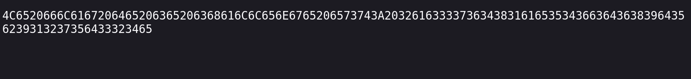
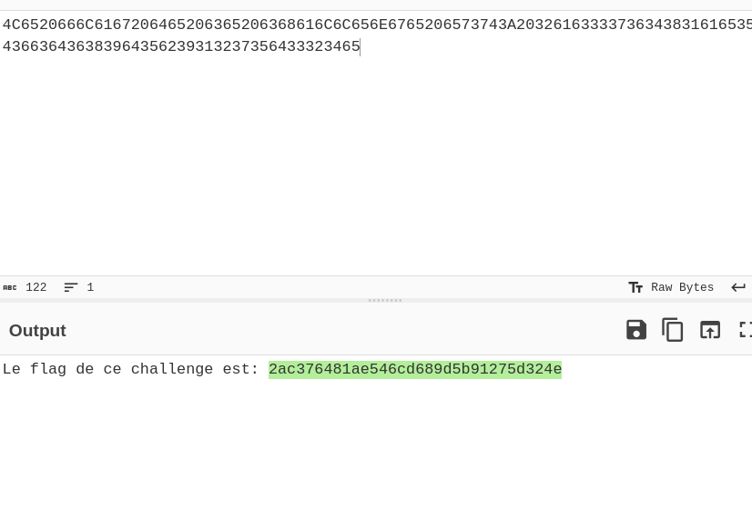

# Encoding - ASCII - CTF Challenge Writeup

## Challenge Information
- **Name**: Encoding - ASCII
- **Points**: 5
- **Category**: Cryptanalysis

## Objective
The objective of the "Encoding - ASCII" CTF challenge in the Cryptanalysis category is to decode a hexadecimal-encoded message to reveal its content.

## Solution
To successfully complete the "Encoding - ASCII" challenge and decode the provided message, I followed these steps:

1. **Initial Assessment**:
   - I received a string of hexadecimal-encoded characters as the challenge's target.
   
2. **Decoding with CyberChef**:
   - To decode the message, I employed CyberChef, a versatile online tool that simplifies the process of decoding and encoding data.
   - I pasted the hexadecimal-encoded message into the input field in CyberChef.
   - I used a suitable operation or recipe in CyberChef to decode the hexadecimal input and reveal the plaintext message.

        
        

By using CyberChef to decode the hexadecimal-encoded message, I was able to successfully complete the "Encoding - ASCII" CTF challenge in the Cryptanalysis category.

This writeup outlines a straightforward solution to the challenge, involving the use of CyberChef to decode the provided hexadecimal-encoded message.

If you have any further questions or need additional details, please don't hesitate to ask.
