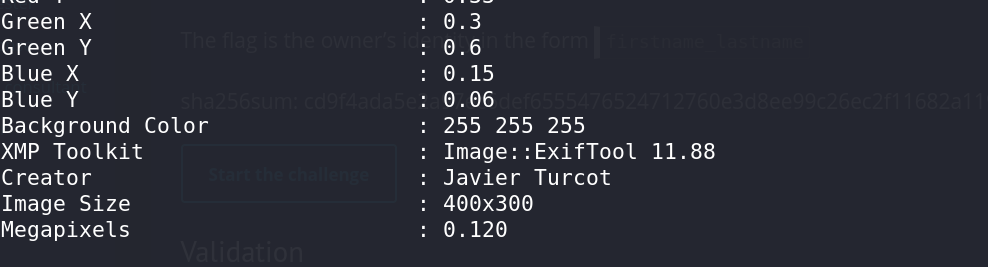

# Deleted File - CTF Challenge Writeup

## Challenge Information
- **Name**: Deleted File
- **Points**: 5
- **Category**: Forensics

## Objective
The objective of the "Deleted File" CTF challenge in the Forensics category is to recover a deleted file and extract specific information from it.

## Solution
To successfully complete the "Deleted File" CTF challenge, I followed these steps:

1. **Unzipping the Challenge File**:
   - I began by unzipping the provided challenge file. Upon extraction, I encountered a Posix archive.

2. **Extracting the Posix Archive**:
   - I used the `tar` command to extract the contents of the Posix archive. The command I used was:
     ```bash
     tar xvf "filename" --posix
     ```
   - This command successfully extracted the contents from the Posix archive.


        

3. **Examining the Extracted Files**:
   - After extraction, I found a USB image file among the contents. The challenge involved examining this image to recover deleted data.

4. **Using Foremost for Data Recovery**:
   - I used the `foremost` tool, which is well-suited for data recovery and file carving, to extract information from the USB image.
   - This tool helped me recover deleted files and extract additional data.

5. **Locating the Recovered PNG**:
   - After running `foremost`, I noticed that it had successfully recovered a PNG image.

6. **Using Exiftool to Find the Name**:
   - To determine the name associated with the recovered PNG image, I employed `exiftool`.
   - By using `exiftool`, I identified the name of the file.


        

7. **Submitting the Name in Lowercase**:
   - The challenge required submitting the name of the recovered file in lowercase format.

By following these steps and using the `tar` command, `foremost`, and `exiftool`, I successfully recovered a deleted file from the USB image, extracted its name, and submitted it in lowercase to complete the "Deleted File" CTF challenge in the Forensics category.

If you have any additional questions or need further clarification, please feel free to ask.
