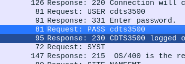

# Challenge Writeup: FTP Authentication
**Points:** 5
**Category:** Network

## Objective:
In this challenge, we are provided with a packet capture (pcap) file, which typically contains network traffic data. The goal is to extract sensitive information related to FTP authentication.

## Solution:
To solve this challenge, follow these steps:

1. Open Wireshark and load the provided pcap file.

2. Once the pcap file is loaded, look for FTP protocol traffic. You can do this by typing "ftp" in the display filter box or using a display filter like `ftp` to narrow down the packets related to FTP.

3. Scan through the packets until you find an FTP authentication session, which should contain login and password information.

4. Analyze the FTP authentication packets and extract the plaintext password.

      

Once you locate and extract the plaintext password, you've successfully completed the challenge. Be sure to maintain good ethical practices and respect privacy when working with network data.

Flag: CTF{XXXXXXXXXX}
