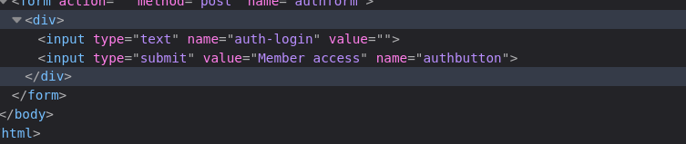
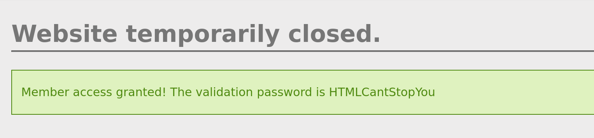

# HTML - Disabled Buttons - CTF Challenge Writeup

## Challenge Information
- **Name**: HTML - Disabled Buttons
- **Points**: 5
- **Category**: Web-Client

## Objective
The objective of the "HTML - Disabled Buttons" CTF challenge is to uncover a hidden flag on a web client application. Your task is to explore the HTML source code of the web page, identify the disabled buttons, and re-enable them to reveal the flag.

## Solution
To successfully complete the "HTML - Disabled Buttons" challenge, follow these steps:

1. **Initial Website Assessment**:
   - When you first access the website, it may appear that all functionalities are unavailable. This is often a common trick in CTF challenges to mislead participants.

2. **Inspecting the HTML Document**:
   - Right-click on the web page and select "Inspect" or "View Page Source" to access the HTML source code of the webpage.
   - Within the HTML source, search for the buttons that appear to be disabled. Look for elements with the `disabled` attribute in the HTML.

3. **Reversing the Disabled State**:
   - In many cases, buttons are disabled using HTML alone and not on the server-side. This means you can manipulate the HTML to "enable" the disabled buttons.
   - To do this, simply remove the `disabled` attribute from the HTML element for the button you want to enable.

        

4. **Interacting with the Enabled Button**:
   - After re-enabling the button, click on it, and it should now be functional.
   - Interact with the button as you normally would, and it will reveal the flag within the web client application.

        

By following these steps and leveraging your understanding of HTML and web client manipulation, you can successfully complete the "HTML - Disabled Buttons" challenge. This exercise is an excellent opportunity to practice web client inspection and manipulation techniques.

I hope this writeup provides you with the necessary guidance to approach and solve the "HTML - Disabled Buttons" CTF challenge effectively. If you have any questions or need further assistance, please feel free to ask.
