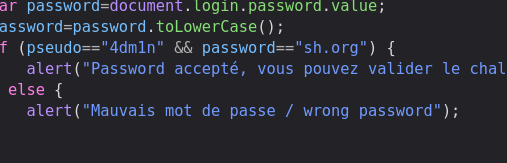

# JavaScript - Authentication - CTF Challenge Writeup

## Challenge Information
- **Name**: JavaScript - Authentication
- **Points**: 5
- **Category**: Web-Client

## Objective
The objective of the "JavaScript - Authentication" CTF challenge is to bypass client-side validation and reveal the password required for authentication. Your task is to analyze the website's client-side JavaScript code to identify the hidden password.

## Solution
To successfully complete the "JavaScript - Authentication" challenge, follow these steps:

1. **Initial Website Assessment**:
   - Upon accessing the website, it may appear that the authentication process is enforced by client-side validation.

2. **Inspecting the JavaScript Code**:
   - Right-click on the web page and select "Inspect" or "View Page Source" to access the HTML source code of the webpage.
   - In the HTML source, look for any linked JavaScript files or inline JavaScript code.

3. **JavaScript Analysis**:
   - Dive into the JavaScript code used by the website. This is where client-side validation and authentication logic are often implemented.
   - Pay attention to functions, variables, or conditions that may be related to the password validation process.

4. **Revealing the Hidden Password**:
   - In the JavaScript code, you may find the password or clues related to it. It's common to see passwords or authentication details stored within the JavaScript code for client-side authentication.
   - Use your browser's JavaScript console (usually accessible through the developer tools) to execute JavaScript commands.
   - Try to access and extract the password from the JavaScript code using your browser's JavaScript console.

        

By following these steps and leveraging your knowledge of web client-side scripting, you can successfully complete the "JavaScript - Authentication" challenge. This challenge is an opportunity to practice bypassing client-side validation and understanding how to uncover hidden information within web client code.

I hope this writeup provides you with the necessary guidance to approach and solve the "JavaScript - Authentication" CTF challenge effectively. If you have any questions or need further assistance, please feel free to ask.
