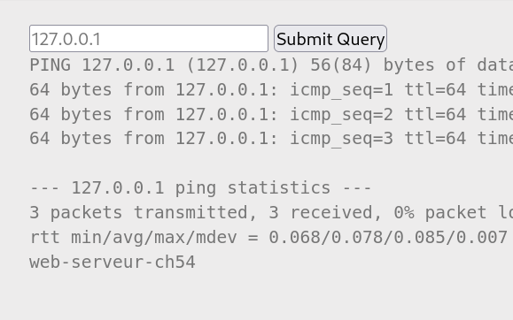
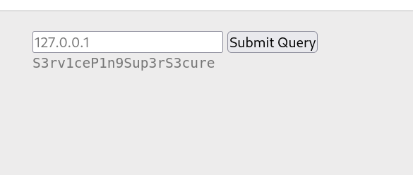

# PHP - Command Injection - CTF Challenge Writeup

## Challenge Information
- **Name**: PHP - Command Injection
- **Points**: 10
- **Category**: Web - Server

## Objective
The objective of the "PHP - Command Injection" CTF challenge is to exploit a command injection vulnerability to retrieve sensitive information, specifically a password stored in a file.

## Solution
To successfully solve the "PHP - Command Injection" challenge, I followed these steps:

1. **Initial Observation**:
   - Upon accessing the web instance, discovered the ability to execute commands, notably the `ping` command.

2. **Identifying Command Injection Potential**:
   - Speculated that the web application might be executing Linux commands, hence allowing command injection.
   - Tested this by attempting to terminate commands using the semi-colon `;` to perform arbitrary actions.

3. **Proof of Concept (POC)**:
   - Executed a Proof of Concept by injecting the command `whoami`.
   - Successfully received an output, indicating command execution.

        

4. **Extracting the Flag**:
   - Attempted to retrieve the flag as per the challenge description, which was located in the `index.php` file.
   - Encountered a peculiar output, prompting further investigation.

      

5. **Examining Source Code**:
   - Inspected the source code of the webpage.
   - Discovered that the password was stored in a file named `.passwd`.

6. **Printing the Password File**:
   - Executed a command injection to print the contents of the `.passwd` file.
   - Retrieved the password stored in the file by leveraging the command injection vulnerability.

      

## Conclusion
The "PHP - Command Injection" challenge was overcome by exploiting a command injection vulnerability within the web application. By injecting commands via the vulnerable `ping` functionality and exploring the source code, the password stored in the `.passwd` file was successfully retrieved.

This writeup illustrates the process of identifying and exploiting command injection vulnerabilities to extract sensitive information in the Web - Server category. For additional assistance or clarification, feel free to ask.
